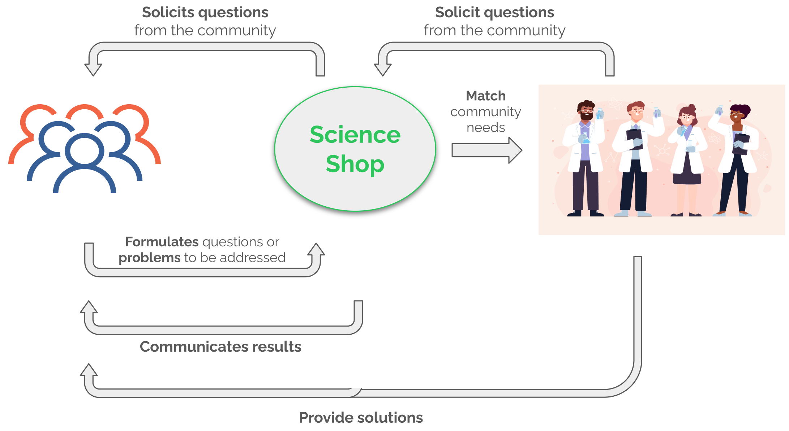

# 🎉 Welcome to the Sci4AllFood project!!

The main aim of this project is to create a **Food Science Shop** around the Madrid region, which could be extended to other Spanish areas.

We are happy to welcome everybody to collaborate in this project.

### What is a Science Shop?
A Science Shop is a kind of framework which engages the public as research demanders to a scientific community which will try to resolve their issues.
The Science Shop acts as the intermediary with these roles:
- Get the public research demands.
- Contact the approppriate research groups which can perform the research which can resolve the public issue.
- Communicate the results and act as contact point between scientists and the general public.

### Why a Science Shop related with Food and Nutrition?
We believe that Spanish society, although it relies heavily on scientists, is not familiar with the scientific method and research development.
We also think that pseudo-sciences are being massively spread through social media and we are afraid that magical beliefs may be more trusted that scientific facts. This is specially relevant in the Food and Nutrition area, where facts without scientific evidence are strongly believed by society.

We hope that by engaging the public and providing them direct solution for their food-related problems, the Spanish society would be more prone to think scientificaly about what they eat and their effects.

### HOW TO COLLABORATE?
As an starting initiative, we will begin only virtually for now through our website.

Our website and communication with the public will be in Spanish, but we invite everybody to collaborate with us in everything which do not involve direct contact with the public in English too.

You can choose to add you as collaborator to this project or drop us an email to [foodscienceshop@gmail.com](foodscienceshop@gmail.com).

You can check our Code of Conduct [here](CODE_OF_CONDUCT.md)!
